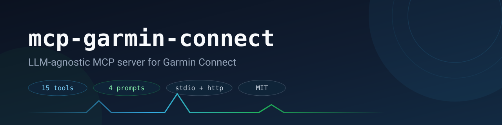

[](https://www.python.org/)
[](https://pypi.org/project/mcp-garmin-connect/)
[](https://modelcontextprotocol.io/)
[](LICENSE)
[](https://github.com/kavakoss/mcp-garmin-connect/actions/workflows/ci.yml)

**LLM-agnostic Garmin Connect MCP server** for training, recovery, sleep, stress, VO2 Max, race predictions, and running summaries.

Use the same local Garmin tools from any MCP client — Claude Desktop, Claude Code, Cursor, Continue, Hermes, opencode — or from provider-backed demo agents using DeepSeek, OpenAI, Claude, OpenRouter, or Gemini.

## See It In Action


Recorded with `garmin-mcp serve --demo`, which serves deterministic **fictional** sample data — no Garmin credentials and no real health data involved:

```bash
uvx mcp-garmin-connect serve --demo
```

## Works With Any MCP Harness

This server implements standard MCP over `stdio` and Streamable HTTP, so there is no harness-specific adapter to maintain. If your tool speaks MCP, it works:

| Harness | Connection |
|---|---|
| Claude Code / Claude Desktop | `mcpServers` stdio config |
| Codex CLI | MCP server config |
| Gemini CLI | MCP server config |
| Cursor, Windsurf, Zed, VS Code Copilot, Continue | MCP server settings (stdio or HTTP) |
| opencode | `mcp` block in `opencode.json` |
| Hermes | stdio or HTTP |
| Custom agents, web bots, scripts | Streamable HTTP at `http://127.0.0.1:8765/mcp` |

Any client that supports MCP over `stdio` or Streamable HTTP can use every tool and prompt in this server with no extra code.

## Why This Exists

Most fitness advice from LLMs is generic. This server lets an LLM inspect your real Garmin Connect data first, then answer with context from your activities, recovery markers, HRV, sleep, stress, VO2 Max, and running history.

The core server is provider-neutral. DeepSeek, OpenAI, Claude, OpenRouter, and Gemini integrations are optional demo bridges for clients that do not speak MCP directly.

## Features

- **Published on PyPI** — run it with `uvx mcp-garmin-connect`, no clone or manual install.
- **15 Garmin tools and 4 prompt templates** for training and recovery analysis.
- **Demo mode** — `serve --demo` runs on fictional sample data with no credentials, for try-outs and recordings.
- **Local MCP server** over `stdio` or Streamable HTTP (`/mcp`).
- **Endpoint-level TTL cache with single-flight factories** — concurrent tool calls share one Garmin request instead of stampeding the API.
- **Global request concurrency cap** so parallel snapshots stay within a safe request rate.
- **Partial-error reporting** — composite tools include an `errors` array when an endpoint fails, instead of silently returning nulls.
- **Provider demo bridge** for `deepseek`, `openai`, `claude`, `openrouter`, and `gemini`.
- **Explicit opt-in** before Garmin health/activity data is sent to any external LLM provider.
- **Mocked test suite** plus optional live Garmin smoke tests.

## Quick Start

### Option A — published package (no clone needed)

```bash
uvx mcp-garmin-connect login
uvx mcp-garmin-connect serve --transport stdio
```

`uvx` runs the latest PyPI release in an isolated environment. Export `GARMIN_EMAIL` / `GARMIN_PASSWORD` (or keep a `.env` in the directory you launch it from) before the first `login`.

### Option B — from source

```bash
git clone https://github.com/kavakoss/mcp-garmin-connect
cd mcp-garmin-connect
uv sync
cp .env.example .env
```

Set Garmin credentials in `.env`:

```env
GARMIN_EMAIL=you@example.com
GARMIN_PASSWORD=your-password
```

Authenticate once (interactive MFA supported):

```bash
uv run garmin-mcp login
uv run garmin-mcp doctor --live
```

List available MCP tools, then run the server:

```bash
uv run garmin-mcp tools
uv run garmin-mcp serve --transport stdio
```

HTTP transport:

```bash
uv run garmin-mcp serve --transport http --host 127.0.0.1 --port 8765
# clients connect to http://127.0.0.1:8765/mcp
```

> Windows (PowerShell) equivalents: `uv sync`, `Copy-Item .env.example .env`, `notepad .env`, then the same `uv run garmin-mcp ...` commands.

## MCP Client Setup

Generic `stdio` config using the published package (`uvx`):

```json
{
  "mcpServers": {
    "garmin": {
      "command": "uvx",
      "args": ["mcp-garmin-connect", "serve", "--transport", "stdio"],
      "env": {
        "GARMIN_EMAIL": "you@example.com",
        "GARMIN_PASSWORD": "your-password"
      }
    }
  }
}
```

From a local checkout, replace `command`/`args` with:

```json
{
  "mcpServers": {
    "garmin": {
      "command": "uv",
      "args": [
        "--directory",
        "/path/to/mcp-garmin-connect",
        "run",
        "garmin-mcp",
        "serve",
        "--transport",
        "stdio"
      ]
    }
  }
}
```

With the local checkout, credentials are also read from the repo's `.env` file, so the `env` block is optional.

[opencode](https://opencode.ai) (`opencode.json`):

```json
{
  "mcp": {
    "garmin": {
      "type": "local",
      "command": [
        "uv",
        "--directory",
        "/path/to/mcp-garmin-connect",
        "run",
        "garmin-mcp",
        "serve",
        "--transport",
        "stdio"
      ],
      "enabled": true
    }
  }
}
```

Per-client examples (Claude Desktop, Claude Code, Cursor, Continue, Hermes, generic stdio/HTTP) live in [docs/clients](docs/clients/README.md).

## MCP Tools

| Tool | Purpose |
|---|---|
| `get_recovery` | Readiness, HRV, sleep, body battery, resting HR, training status if available |
| `get_sleep` | Sleep duration and sleep score trends |
| `get_resting_heart_rate` | Daily RHR with 7-day and 30-day trend summaries, up to 30 days |
| `get_stress` | Daily stress buckets and average stress |
| `get_recent_activities` | Recent normalized activity summaries |
| `get_activity_detail` | One activity with training effect fields |
| `get_recent_load` | Volume by sport based on recent activities |
| `get_training_load` | Native Garmin Training Load when the device/account exposes it |
| `get_fitness` | VO2 Max, FTP, and race predictions |
| `get_zones` | Heart-rate zones and thresholds from Garmin user settings |
| `get_personal_records` | Garmin personal records |
| `get_running_summary` | Running summary with pace, HR, longest and fastest run |
| `get_monthly_running_stats` | Monthly running breakdown |
| `get_health_summary` | Compact recovery, sleep, RHR, and stress snapshot |
| `get_full_snapshot` | Broad multi-section Garmin snapshot |

## MCP Prompts

- `recovery_check`
- `weekly_training_review`
- `activity_analysis`
- `race_plan_context`

## Configuration

All settings come from environment variables (`.env` is loaded automatically).

| Variable | Default | Purpose |
|---|---|---|
| `GARMIN_EMAIL` | — | Garmin Connect account email (required) |
| `GARMIN_PASSWORD` | — | Garmin Connect password (required) |
| `GARMIN_TOKEN_STORE` | `~/.garminconnect` | Directory for the OAuth token cache |
| `GARMIN_CACHE_TTL_SECONDS` | `120` | TTL for cached Garmin endpoint responses |
| `GARMIN_MAX_CONCURRENCY` | `6` | Global cap on in-flight Garmin requests |
| `GARMIN_DEMO` | unset | `1` serves fictional sample data (same as `serve --demo`) |

Provider bridge variables (optional): `DEEPSEEK_API_KEY`, `OPENAI_API_KEY`, `ANTHROPIC_API_KEY`, `OPENROUTER_API_KEY`, `GEMINI_API_KEY`, plus the matching `*_BASE_URL` and `*_MODEL` overrides.

## How It Stays Fast And Quiet

- **Endpoint-level cache.** Sleeping, stress, RHR, and activity fetches are cached per day/limit and shared across every tool that needs them — a `get_full_snapshot` burst reuses the same responses instead of refetching.
- **Single-flight.** If two tool calls ask for the same missing key, only one hits Garmin; the other waits and reuses the result.
- **Failures are never cached.** A failed endpoint is retried on the next call.
- **Concurrency cap.** All outbound Garmin calls pass through one bounded semaphore (`GARMIN_MAX_CONCURRENCY`) so parallel sections cannot flood the API.
- **Visible partial failures.** When an optional endpoint fails, composite tools add an `errors` array (source + exception) to their output.

## Provider Demo Agents

Provider API access may require a paid account or credits even if the provider's web app has a free tier.

```env
DEEPSEEK_API_KEY=sk-...
OPENAI_API_KEY=sk-...
ANTHROPIC_API_KEY=sk-ant-...
OPENROUTER_API_KEY=sk-or-...
GEMINI_API_KEY=...
```

| Provider | Env key | Default model | API style |
|---|---|---|---|
| DeepSeek | `DEEPSEEK_API_KEY` | `deepseek-v4-pro` | OpenAI-compatible Chat Completions |
| OpenAI | `OPENAI_API_KEY` | `gpt-5` | OpenAI Chat Completions |
| Claude | `ANTHROPIC_API_KEY` | `claude-sonnet-5` | Anthropic Messages API |
| OpenRouter | `OPENROUTER_API_KEY` | `google/gemini-3-flash-preview` | OpenAI-compatible Chat Completions |
| Gemini | `GEMINI_API_KEY` | `gemini-3.6-flash` | Gemini Generate Content API |

```bash
uv run garmin-mcp ask "How is my recovery today?" --provider deepseek --allow-external-health-data
uv run garmin-mcp ask "Summarize my running for 90 days." --provider openai --allow-external-health-data
uv run garmin-mcp ask "What should I focus on this week?" --provider claude --allow-external-health-data
```

The `--allow-external-health-data` flag is required because Garmin tool results can be sent to the selected provider.

## Privacy And Safety

- Your `.env` file and Garmin token cache stay local and are ignored by git.
- MCP clients that run locally can call Garmin tools without sending provider API keys to this project.
- Provider demo commands such as `garmin-mcp ask` can send Garmin health/activity results to the selected LLM provider, so the CLI requires `--allow-external-health-data`.
- `get_zones` returns only zone/threshold fields from the Garmin profile, not the raw profile (gender, birth date, weight, and similar PII are trimmed).

## Testing

```bash
uv run garmin-mcp doctor
uv run garmin-mcp doctor --live
uv run garmin-mcp tools
uv run ruff check .
uv run pytest
```

CI runs on Linux (Python 3.11, 3.12, 3.13) and Windows (3.12). Optional live tests are gated and never run in CI:

```powershell
$env:GARMIN_LIVE_TEST = "1"
uv run pytest tests/live
```

## Troubleshooting

- **`Garmin rate-limited the request`** — lower `GARMIN_MAX_CONCURRENCY` (for example to `3`) and retry after a few minutes.
- **`Garmin authentication failed`** — check `GARMIN_EMAIL`/`GARMIN_PASSWORD`, then run `uv run garmin-mcp login` from a real terminal (MFA prompts need interactive input).
- **A tool returns `errors`** — the array names the endpoint that failed; the rest of the payload is still valid partial data.

## Garmin Disclaimer

This project uses the community `garminconnect` Python package and Garmin Connect endpoints. Garmin Connect is not a public API for individual open-source projects, and authentication or endpoint behavior may change without notice.

Some metrics depend on Garmin device capabilities. For example, a device may expose VO2 Max and Training Effect but not native Garmin Training Load or Training Status. Zone availability depends on what the Garmin user settings endpoint exposes for your account.

## License

This project is licensed under the [MIT License](LICENSE).

Made by [kavakoss](https://github.com/kavakoss). Inspired by [Jack-Abyss/claude-garmin](https://github.com/Jack-Abyss/claude-garmin), with a clean-room implementation focused on LLM-agnostic MCP usage.
